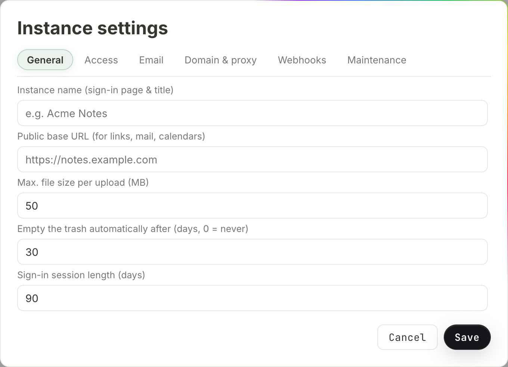
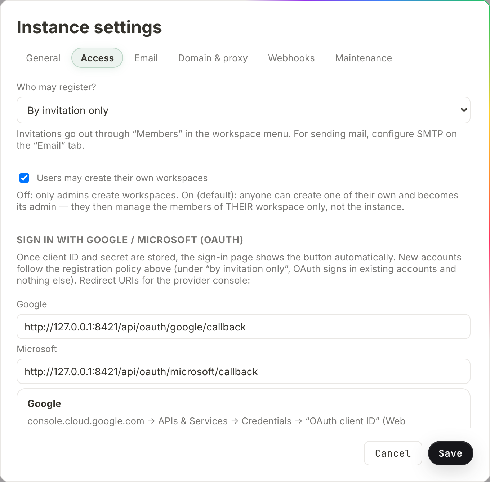
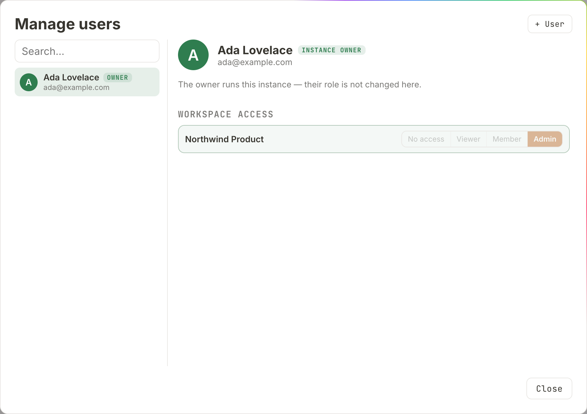

# Administration

Running the instance: naming it, deciding who may get an account, inviting
people, managing accounts through their whole life, cleaning up workspaces
nobody is left in charge of, and taking a backup. This page is for the person
who installed Salt.md and for anyone they made an instance admin. It describes
what the dialogs actually do — the role model behind them is in
[Permissions](permissions.md).

Two words matter throughout. An **instance admin** manages people and the
server's configuration. The **owner** is exactly one account and additionally
holds the account lifecycle, emergency access and the backup. Almost everything
below is open to any admin; the owner-only parts say so.

## Where administration lives

Everything is reached from the sidebar.

| Dialog | How to get there | Who sees it |
| --- | --- | --- |
| **Instance settings** | your name at the bottom of the sidebar → **Instance settings** | instance admins |
| **Manage users** | your name at the bottom of the sidebar → **Manage users** | instance admins |
| **Workspaces with nobody in charge** | the workspace name at the top → **With nobody in charge…** | the owner |
| **Workspace members** (invitations) | the workspace name at the top → **Workspace settings** → **Members** | admins of that workspace |

Administrative *changes* need a browser sign-in. An API token, whatever its
scope, is turned away with *"This action requires signing in through a browser —
an API token is not enough."* That is deliberate: a token is a second key to
content, not an administration pass. See
[Permissions](permissions.md#sessions-and-api-tokens).

## Instance settings

Six tabs — **General**, **Access**, **Email**, **Domain & proxy**, **Webhooks**,
**Maintenance** — and one pair of buttons at the bottom, **Cancel** and **Save**.
**Save** writes the fields of every tab at once, so you can change the instance
name and the signup policy in one pass. Three things do **not** wait for Save
because they act immediately: starting or stopping a tunnel, connecting or
disconnecting a mail account, and sending a test mail.

### General

| Field | Default | Range |
| --- | --- | --- |
| **Instance name (sign-in page & title)** | empty | free text |
| **Public base URL (for links, mail, calendars)** | empty | a URL |
| **Max. file size per upload (MB)** | 50 | 1–2048 |
| **Empty the trash automatically after (days, 0 = never)** | 30 | 0–3650 |
| **Sign-in session length (days)** | 90 | 1–365 |



**The instance name** replaces the wordmark on the sign-in page, becomes the
browser tab title, and names the instance on the approval screen an agent sees
when it signs in ([Agent access](agent-access.md)). Left empty, the sign-in page
says *salt.md*. The placeholder in the field is *e.g. Acme Notes* — pick your
own name, not that one.

There is **no instance logo**. The Salt.md mark above the sign-in heading is
fixed; the picture you can change is per workspace, in
[Workspace settings](workspaces.md).

**The public base URL** is what invitation links, public share links, the
calendar subscription and the agent connection command are built from — not the
address your browser happens to be using, which matters the moment somebody
opens the interface on a LAN address and copies a link out of it. With a
Cloudflare tunnel or the built-in HTTPS domain running, links fall back to those
and the field can stay empty. See [Reaching it from outside](domain.md).

**The upload cap** is enforced per file, in the browser upload and over MCP
alike; a larger file is refused with *"file too large — max 50 MB"*.

**The trash setting** is swept by a background pass every 30 minutes: pages
trashed longer ago than the limit are deleted for good. `0` disables the sweep
and the trash keeps everything. Without a stored setting the environment
variable `SALT_TRASH_DAYS` decides, and failing that 30 days. See
[Trash and recovery](trash-and-recovery.md).

**The session length** applies to sessions created from then on — it is both the
cookie's lifetime and the row in the database, so an old session is not
retroactively shortened or extended.

### Access

**Who may register?** — three policies:

| Option | What happens |
| --- | --- |
| **By invitation only** (default) | self-registration is refused; the sign-in page shows no "create account" link |
| **Email domain allowed** | anyone whose address is at one of the listed domains may register themselves |
| **Open (anyone)** | anybody with the address of the instance may register |



Choosing **Email domain allowed** reveals **Allowed domains (comma separated)**.
The list never leaves the server: the sign-in page is told only the mode, so a
stranger cannot read off which sender domains this house trusts. Someone whose
address does not match is told *"This email address cannot register on its own.
Ask for an invitation."* — without naming the domains either.

The policy governs [single sign-on](sso.md) too. Under **By invitation only**, a
Google or Microsoft button signs *existing* accounts in and creates none: an
unknown address gets *"no account for … — registration here is by invitation"*.

Whichever way an account comes into being — self-registration, SSO, an
invitation, or created by an admin — it lands in exactly two places: **its own
personal space**, named after the person, and **every workspace marked "Open to
every new user"**. Nothing else. An account created by an admin does not inherit
that admin's workspaces.

**Users may create their own workspaces** — a checkbox, on by default. Off, only
admins create workspaces, and everyone else gets *"creating workspaces is
disabled on this instance — ask an admin"*. On, anybody can create one and
becomes its workspace admin — which makes them responsible for that one
workspace's members, not for the instance.

The rest of the tab configures **Sign in with Google / Microsoft (OAuth)**: the
redirect URIs to paste into the provider's console are shown ready to copy, and
the client ID and secret go underneath. A stored secret shows as *•••••• (stored)*
and is never sent back to the browser. The whole procedure, including the one
mistake that costs an afternoon, is in [Single sign-on](sso.md).

### Email

Either connect a Google or Microsoft mailbox with one click, or fill in SMTP
host, port, user, password and sender. **Send test mail** sends to *your own*
address and reports the result. Details, including why mail is a convenience and
never a dependency, are in [Sending email](mail.md).

### Domain & proxy

A quick Cloudflare tunnel, a permanent one with your own domain, built-in
Let's Encrypt HTTPS, or generated Caddy / cloudflared / nginx snippets for a
proxy you run yourself. Also **Run behind a reverse proxy (trust
`X-Forwarded-For`)**, which decides whether the instance believes proxy headers
about who a visitor is. Leave it off without a proxy — with it on, anybody could
claim any address and walk past the sign-in rate limit. See
[Reaching it from outside](domain.md).

### Webhooks

Call an address of your choosing when a page is created, changed or thrown away.
The message names the page and never carries its content. See
[Webhooks](webhooks.md).

### Maintenance

**Download backup (.tar.gz)** produces a consistent snapshot of the whole
database plus every upload, in one archive. It is **owner-only**: the button is
visible to any admin, but the server answers *"Only the owner can download an
instance backup — it contains every workspace."* The archive holds every
workspace, every file and every password hash, which is why it does not follow
the admin flag.

Restoring, and taking backups on a schedule, happen on the server:

```
./salt restore backup.tar.gz     # replaces the data directory's contents
./salt backup                    # writes salt-backup.tar.gz — put this in cron
```

Below the button, **Instance** shows a live snapshot:

| Row | What it says |
| --- | --- |
| **Version** | version · Go version · operating system and architecture |
| **Uptime** | since the process started |
| **Users / workspaces** | how many of each exist |
| **Pages (trashed)** | active pages, with trashed ones in brackets |
| **Database** | size of the SQLite file |
| **Uploads** | total size of the files directory |
| **Data directory** | where on disk that is |
| **Your IP (as the server sees it)** | plus *proxy headers active* when the proxy switch is on |

The last row is the honest way to test the proxy setting: it echoes the address
the server believes you have.

## Invitations

An invitation is per workspace and creates no account until it is accepted.

1. Switch to the workspace, open **Workspace settings** → **Members**.
2. Type an address in **Invite by email (blank = link only)**, or leave it empty.
3. Pick the role the person should get: **Member**, **Viewer** or **Admin**.
4. Press **Invite**.

The link is copied to your clipboard at once and shown under **Invitation link
(valid 14 days, copied):**. If you gave an address and mail is configured, the
invitation also goes out by email; the toast says which happened —
*Invitation sent by email* or *Invitation link copied*. Mail failing costs
nothing: the link is on screen either way, ready to paste into a chat.

Invitation mail is written **in English** whatever language the interface is in,
because it reaches somebody who has no account yet and therefore no known
language.

What the recipient sees at `/invite/<token>`:

- **Not signed in, no account yet** — a small form for name, email and password
  (minimum 8 characters). Accepting creates the account, joins it to the
  workspace with the invited role, and signs them in.
- **Not signed in, but the address already has an account** — the same form asks
  for the real password, and for the six-digit code if that account uses
  two-factor sign-in. This is a sign-in, so it is treated as one: a leaked
  invitation link can never take over an existing account.
- **Already signed in** — a one-click **Join**. If the invitation was addressed
  to a different account, joining is refused and they are asked to sign out
  first.

Two limits worth knowing. A link is **single use**: accepting deletes it. And
joining never *changes* an existing membership — somebody who is already a
member with a higher role keeps it.

Only a workspace admin of the target workspace may create the invitation, owner
or not.

## Manage users

The left pane lists every account with a **Search…** box above it. Badges mark
them: *deactivated*, *owner*, *admin*. Pick one and the right pane shows the
detail; press **+ User** to create one instead. Everything that can happen to an
account in its lifetime is on that right-hand pane.



### Creating an account directly

**+ User** opens **Create a new user**, and the subtitle says what that means:
*Creates the account straight away — no email is sent.* You supply **Name**,
**Email** and an **Initial password (min. 8 characters)**, optionally tick
**Instance admin (may manage everything)**, and set a role per workspace under
**Workspace access**. Then **Create user**.

Two things happen that the form does not show. The account gets its own personal
space and any workspaces open to everybody, regardless of what you ticked. And
assignments are honoured only for workspaces you may actually grant — the owner
anywhere, an admin only where they are a workspace admin themselves. A row you
are not entitled to grant is silently skipped rather than refused, so check the
result if you were assigning outside your own workspaces.

There is **no password-reset email** in Salt.md, and no field in this dialog for
setting somebody else's password. Only the owner may change another account's
password or email at all, and today only through the API
(`PATCH /api/users/{id}`). For everyday cases the answer is an invitation or a
new account.

### The actions on an account

| Button | Who may press it | Effect |
| --- | --- | --- |
| **Make instance admin** / **Revoke admin rights** | admins | grants or removes instance administration |
| **Deactivate account** / **Reactivate** | admins | see below |
| **Delete user** | the owner | permanent, see below |
| **Hand over the instance** | the owner | see below |

None of them appear on your own row, and none on the owner's — *"The owner runs
this instance — their role is not changed here."* You cannot remove your own
admin rights (you would lock yourself out of the dialog you are standing in),
and the last remaining admin cannot be demoted. An admin who is not the owner
sees, in place of **Delete user**, the sentence *"Only the owner can delete
permanently — the account would take this person's personal space with it."*

### Workspace access

Under the actions, one row per workspace with four buttons: **No access**,
**Viewer**, **Member**, **Admin**. Clicking one applies it immediately.

- The **owner** sees every shared workspace on the instance; an **admin** sees
  only the ones they are a workspace admin of.
- **Personal spaces never appear here**, not even for the owner. Whoever wants a
  guest in their own space invites them through their own members dialog.
- You cannot grant yourself anything: *"You cannot grant yourself access here."*
- The last active admin of a workspace cannot be demoted or removed —
  *"cannot remove the last admin of …"*.

On the owner's own row, a workspace they have no access to offers **Emergency
access**. It asks for a reason (at least 10 characters), then grants **read**
access for two hours, writes it to the [activity log](history-and-audit.md) and
emails that workspace's admins, who can end it at any time. It is refused for
personal spaces. See [Permissions](permissions.md#emergency-access).

## Deactivating an account

Deactivating is the normal move when somebody leaves. Nothing is lost and
everything stays attributable to them.

The moment it is applied:

- signing in is refused — *"This account has been deactivated — talk to an
  admin."*
- every session ends, so an already-open browser is signed out
- every API token of that account is deleted
- their calendar subscription link stops working
- any editor they have open is disconnected, rather than typing into nothing
  until the next reload

Reactivating restores access but not the deleted tokens; those have to be
created again. You cannot deactivate yourself, and the owner cannot be
deactivated at all — *"The owner cannot be deactivated — hand the owner role on
first."*

A deactivated account also stops counting as somebody in charge: a workspace
whose only admin is deactivated is treated as having none, which is what makes
appointing a successor possible.

## Deleting an account

Owner only, and irreversible. Before the confirmation appears, Salt.md works out
what hangs off the account (`/api/users/{id}/deletion-impact`) and puts it in the
question. The lines you may see:

- *The personal space "…" will be deleted too (n pages).* — their own space goes
  with them, along with uploads no other page references.
- *Kept because others work in them: …* — a personal space they had invited
  guests into becomes an ordinary workspace and stays with the remaining
  members. Their **private** pages in it are deleted anyway, so nobody inherits
  them by way of being a workspace admin.
- *Left with nobody in charge: …* — a shared workspace where nobody else is left
  at all. The instance owner takes it on rather than letting it disappear.
- *n pages in shared workspaces stay where they are.* — work in team workspaces
  is not deleted with its author.
- *Deactivating is usually enough — nothing is lost that way.*

If that preview cannot be loaded, the dialog says so instead of looking
harmless, and the server refuses the deletion outright — an empty plan reads
exactly like "nothing hangs off this account".

Three deletions are refused: your own account, the last remaining admin, and the
owner (*"hand the owner role to another account first"*).

There is no undo and no export step built into the flow. If the content matters,
export the workspace first — see [Import and export](import-export.md).

## Handing the instance on

The owner role is not editable; it is handed over. On another account's row,
**Hand over the instance** asks in full: that account becomes owner with
emergency access, instance backup and the right to delete accounts, and *"You
will be an ordinary admin afterwards and cannot undo this yourself."*

The target must be an active account that is **already an instance admin** —
otherwise *"Only an account that is already an instance admin can take the
instance over — make it one first."* A deactivated account cannot take it. There
is never a moment with two owners, and any emergency grants the outgoing owner
was holding end at the handover.

This is the only path out of the role. Without it, an owner who left the company
could only be replaced by editing the database by hand.

## Workspaces with nobody in charge

Owner only, reached from the workspace switcher: **With nobody in charge…**. It
lists workspaces nobody can look after — either with no members at all, or with
members but no active admin among them — and shows page, member and admin counts
with the last known owner's name.

What you can do depends on which case it is:

| Situation | Offered | Why |
| --- | --- | --- |
| no members left, shared workspace | **Adopt**, **Delete** | nobody is affected either way |
| no members left, personal space | **Delete** only, with *Orphaned personal space — clean up only, do not open.* | it belonged to one person; clearing it up is fair, reading it is not |
| members remain, no admin | nothing here — *Still has members: make one of them an admin.* | the workspace belongs to the people in it |

**Adopt** makes you its admin and owner. **Delete** asks you to type the
workspace name back, then removes its pages, its search entries and the uploads
nothing else references. Both are recorded in the activity log.

A personal space whose person is still a member never appears here, even while
that account is deactivated — otherwise every departure would fill the list with
entries nobody can act on.

An empty list says *All clear — every workspace has someone in charge.*

## What administration does not include

- **No per-page permissions.** Access is per workspace plus a private flag per
  page. See [Permissions](permissions.md).
- **No multi-tenancy.** One instance is one organisation, with one owner.
- **No administrative API.** The account routes, the settings, invitations and
  the backup all refuse API tokens. If an agent could create accounts, a leaked
  token would be an account factory. What agents *can* reach is in
  [Agent access](agent-access.md).
- **No reading of content by rank.** Being an instance admin grants no access to
  a workspace. The owner's route in is emergency access, which is time-limited,
  logged and announced to the people affected.

## After an update

The version on the Maintenance tab does not prove what is running: it is a
string, and a mislabelled build reads exactly like a correct one. `/api/health`
returns the same string and is no better evidence. Check something the new code
has and the old does not — a route that answers `401` where an unknown path
falls through to the app with `200`, or a marker in the served files. Installing
and updating is in [Self-hosting](self-hosting.md).
