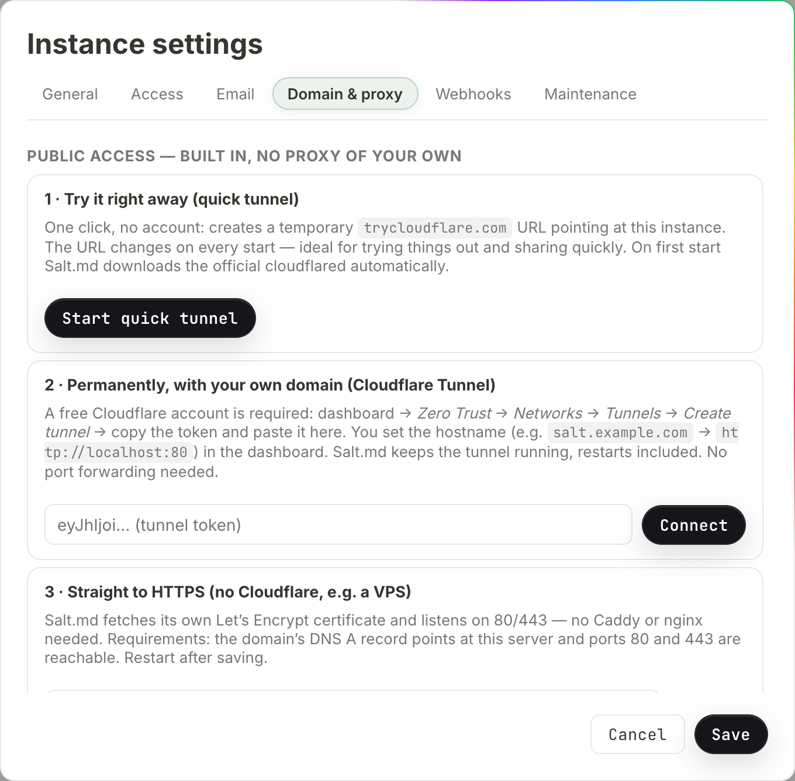

# Reaching your instance from outside

A fresh Salt.md listens on `:8420` and answers on every network interface of the
machine it runs on. That is enough for a laptop and for a server on your own
network. The moment you want a share link that works from a phone, an invitation
that a colleague can open, a calendar subscription, sign-in through Google or
Microsoft, or an agent connecting from somewhere else, you need two things: a
name the outside world can resolve, and Salt.md knowing what that name is.

This page covers both. It is written for whoever administers the instance —
everything here lives in **Instance settings**, which only instance admins see
(the account menu at the bottom of the sidebar → **Instance settings**).

## The public base address

**Instance settings → General → `Public base URL (for links, mail, calendars)`.**
One field, one value, ending without a slash: `https://notes.example.com`.

It is not what the server listens on. It is what Salt.md writes into links it
hands to somebody else. The browser you are using knows the address you typed;
an email does not, a calendar app does not, and a cloud agent certainly does not.

Everything in this list is built from it:

| What | Where it shows up |
| --- | --- |
| Public page links | the share dialog, and `set_sharing` over MCP |
| Public form links | the form-share dialog for a collection |
| Invitation links | the members dialog, and the mail sent with them |
| Calendar subscription | **Subscribe to calendar**, both the `https://` and the `webcal://` form |
| The MCP address | **Connect an agent**, in the snippet you copy |
| The downloadable skill | the address written into the file an agent later reads |
| The instance icon | what an MCP client shows next to this server's name |

### What happens when you leave it empty

Salt.md does not simply fall over — it guesses, in this order, and the guess is
good enough often enough that the field gets forgotten:

1. the public base URL, if set;
2. the domain from the built-in HTTPS setting, if that is switched on;
3. the address of a running **quick tunnel**;
4. the address the current request arrived on.

Step 4 is the one that bites. A link generated while you are browsing at
`http://192.0.2.10:8420` carries that address, and it is correct — for anybody
standing on that network, at that moment. Emailed to someone outside, or written
into a repository for an agent, it is a dead end that looks like a working link.

Step 3 has its own trap: a quick tunnel's address changes every time it starts,
so links minted while one was running stop working when it is restarted.

A **named** Cloudflare tunnel never appears in that list at all. Salt.md hands
the traffic to Cloudflare and never learns the hostname you chose in the
dashboard — the status line says exactly that:
`Tunnel connected — reachable under the hostname set in the Cloudflare dashboard.`
With a named tunnel, filling in the field is not optional.

### Sign-in resolves it slightly differently

Redirect URIs for Google and Microsoft sign-in, and the discovery documents an
MCP client fetches before signing in, use the configured base URL — and, if it is
empty, the address the request came in on. A running tunnel does **not** count
there. So if you sign in with Google, set the field; see
[Signing in with Microsoft or Google](sso.md).

With the field set, Salt.md also redirects the start of an OAuth sign-in to that
origin. Click **Sign in with Google** on `http://192.0.2.10:8420` and the browser
jumps to `https://notes.example.com` first. That is deliberate: the state cookie
set at the start of the round trip belongs to the host that set it, and a flow
that starts on one host and returns on another fails with nothing useful to read.

## Route 1 — the built-in Cloudflare tunnel

**Instance settings → `Domain & proxy`.** It opens on three numbered cards — the
first two belong to this route, the third to the next one.



The machine dials out to Cloudflare and keeps the connection open; nothing has to
accept an incoming connection. This works behind NAT, behind a firewall you do
not administer, and on a home line with no fixed address. No port forwarding.

Salt.md runs `cloudflared` itself. It looks for the program on the system's
`PATH` first, then in `bin/` inside the data directory, and only if neither has
it does it download the official release over HTTPS — which happens the first
time an admin starts a tunnel, never on its own. Builds exist for Linux
(x86-64, arm64, 386, arm), macOS (x86-64, arm64) and Windows (x86-64); anything
else reports that cloudflared has to be installed by hand.

### Trying it — the quick tunnel

Card **`1 · Try it right away (quick tunnel)`** → **`Start quick tunnel`**.

Within a few seconds the status line turns into `Publicly reachable:` followed by
a `trycloudflare.com` address and a **`Copy`** button. No Cloudflare account is
involved. The address is thrown away and regenerated on the next start, so this
is for showing somebody something, not for running on.

**`Stop`** ends it.

### Keeping it — a named tunnel

Card **`2 · Permanently, with your own domain (Cloudflare Tunnel)`**.

What Salt.md needs from you is one value: the tunnel **token**, a long string
starting `eyJhIjoi…`. Everything else happens on Cloudflare's side, and their
documentation is the authority on those screens because they change. The dialog
names the path it expects — *Zero Trust → Networks → Tunnels → Create tunnel* —
and what you have to set up there is:

- a Cloudflare account with your domain in it (the free tier is enough);
- a tunnel, which yields the token;
- a **public hostname** on that tunnel — `notes.example.com` — pointing at this
  machine's own address. That is `http://localhost:8420` with the default listen
  address; the dialog's example says `http://localhost:80` because the systemd
  installation listens there.

Then, in Salt.md:

1. Paste the token into the field on that card. It is a password field; once
   stored, the placeholder reads `•••••• (token stored)` and you never have to
   paste it again.
2. Press **`Connect`**.
3. Wait for `Tunnel connected — reachable under the hostname set in the
   Cloudflare dashboard.`
4. Go to **General** and set the public base URL to `https://notes.example.com`.

A rejected token shows as `Token rejected (Cloudflare refused the connection)`.
An error line carries a **`Reset`** button, which clears the state so you can try
again.

### What it does once it is up

- **It survives restarts.** A named tunnel is remembered and comes back on the
  next start, on its own. Salt.md waits (up to 30 seconds) for its own port to
  answer before dialling out, so the domain does not serve errors during the gap.
- **It restarts itself.** If cloudflared exits, Salt.md waits five seconds and
  starts it again — unless you pressed **`Stop`**, which is the one thing that
  turns the feature off.
- **It leaves cleanly.** On shutdown Salt.md tells Cloudflare the connection is
  going away before it stops serving. Skipping that leaves a dead route
  registered at the edge and the domain unreachable for minutes after a restart.
- **It switches on proxy trust for you.** Behind Cloudflare the forwarded-IP
  headers are trustworthy, so the checkbox further down the same tab
  (`Run behind a reverse proxy (trust X-Forwarded-For)`) is enabled
  automatically, and the sign-in rate limit and the audit log start seeing real
  visitor addresses. Stopping the tunnel does **not** switch it back off — if the
  instance goes back to being reached directly, untick it by hand.

Starting and stopping a tunnel requires a browser session. An API token is
refused with *This action requires signing in through a browser — an API token is
not enough*, the same rule that guards the rest of instance administration
([Administration](administration.md)).

**A tunnel is reachability, not a lock.** Whoever finds the address still meets
the sign-in screen, and that is the thing protecting the content. If you put
Cloudflare Access in front, remember it also sits in front of `/mcp` — an agent
cannot click through a login page. See [Agent access](agent-access.md).

## Route 2 — built-in HTTPS, no proxy at all

Card **`3 · Straight to HTTPS (no Cloudflare, e.g. a VPS)`**, on the same tab.

Enter the domain (`notes.example.com`), tick **`Active`**, press **`Save`**, and
restart the process. Salt.md then fetches and renews its own Let's Encrypt
certificate.

What this changes at startup:

- it listens on **`:443`**, whatever `SALT_ADDR` says;
- a second listener on **`:80`** answers the certificate challenge and redirects
  everything else to HTTPS;
- certificates are cached in `certs/` inside the data directory, so a restart
  does not fetch new ones.

What it needs from the outside: an A or AAAA record for that exact domain
pointing at this machine, and ports 80 and 443 reachable from the internet. Both,
or the certificate is never issued.

`SALT_TLS_CERT` wins over this setting — if you have supplied a certificate pair
yourself, the automatic path is skipped.

## Route 3 — your own reverse proxy

nginx, Caddy, Traefik, HAProxy, a cloudflared you manage yourself. Salt.md asks
for nothing unusual, but four things have to be right.

1. **Pass `X-Forwarded-Proto`.** It is how the instance knows the outside is
   HTTPS, which decides whether the session cookie is marked secure.
   (`X-Forwarded-Ssl: on` is accepted too.)
2. **Let WebSockets through.** Live editing runs over one (`/collab/{id}`). A
   proxy that quietly drops the upgrade leaves an editor where nobody else's
   cursor ever appears and changes arrive only on reload — see
   [Working together](collaboration.md).
3. **Do not buffer `/api/events`.** It is a stream that stays open. Salt.md sends
   `X-Accel-Buffering: no`, which nginx honours; other proxies need telling.
4. **Raise the body limit** to at least the value in
   `Max. file size per upload (MB)` on the General tab, or uploads fail at the
   proxy before Salt.md ever sees them.

Then tick **`Run behind a reverse proxy (trust X-Forwarded-For)`** on the
`Domain & proxy` tab. Without it, Salt.md ignores forwarded-IP headers and every
visitor looks like the proxy — one shared bucket for the sign-in rate limit and
one address in the audit log. **Leave it off when there is no proxy**: those
headers are written by whoever is calling, so trusting them without a proxy in
front lets an attacker invent a new IP for every password guess.

### The generated configuration

Under the checkbox, the field `Internal address of the instance (upstream)` is
prefilled with the address your browser is using. Below it, three ready-made
snippets, each with a **`Copy`** button:

| Block | What it contains |
| --- | --- |
| `Caddy (automatic HTTPS)` | two lines — Caddy handles certificates and WebSockets by itself |
| `Cloudflare Tunnel (no open port needed)` | the commands to create a tunnel by hand plus a `config.yml` |
| `nginx` | a `server` block with the forwarded headers, the WebSocket upgrade, `proxy_read_timeout 3600s` and `client_max_body_size` filled in from your upload limit |

The domain in all three comes from the public base URL, so set that first —
otherwise the examples read `salt.example.com` and you will paste a placeholder
into a real config file.

### Checking that proxy trust actually works

**Instance settings → `Maintenance`** shows
`Your IP (as the server sees it)`. It reads back the address Salt.md attributes
to your request, with `proxy headers active` appended when the checkbox is on.
If that shows the proxy's address rather than yours, the header is not arriving.

## Serving TLS directly from a certificate you already have

Two environment variables, both required:

```sh
SALT_TLS_CERT=/path/fullchain.pem SALT_TLS_KEY=/path/key.pem salt
```

Only one set and the server quietly serves plain HTTP. The rest of the
environment is in [Self-hosting](self-hosting.md).

## Where a fresh installation listens

```sh
curl -fsSL https://raw.githubusercontent.com/salt-md/salt.md/main/install.sh | sh
salt
```

The installer detects the platform (Linux and macOS, x86-64 and arm64), downloads
the matching prebuilt binary and puts it in `/usr/local/bin` — or `$HOME/.local/bin`
when that is not writable and there is no `sudo`. `BIN_DIR=/path` overrides it,
`SALT_VERSION=v1.6.0` pins a version. It then tells you to open
`http://localhost:8420`.

It installs a program; it does not open a port, register a service or configure a
domain. The default listen address `:8420` binds every interface, so the instance
is already reachable from the rest of your network — one of the three routes above
is what makes it reachable beyond that.

The repository also carries a systemd unit and a script to install it, which runs
Salt.md as its own user out of `/opt/salt` and listens on port 80 instead.

## Checking it from outside

```sh
curl https://notes.example.com/api/health
{"status":"ok","version":"1.6.16"}
```

`/api/health` needs no sign-in and pings the database, so it distinguishes a
healthy instance from one that is answering but broken — it returns `503` and
`{"status":"unavailable"}` in that case. It is the right target for a monitor.
The full surface is in [The HTTP API](api.md).

To see what address the instance believes it has, ask it:
`/api/public-base` returns the resolved value — the same one the
**Connect an agent** dialog shows and the same one written into the downloadable
[skill](skill.md).

## The three mistakes that cost an afternoon

**The base URL is empty and everything looks fine.** It does, from your desk.
Test a share link from a phone on mobile data before believing it —
[Sharing](sharing.md) and [Forms](forms.md) both hand out addresses built this
way.

**Sign-in starts on one host and returns on another.** The cookie is scoped to
the host that set it, so nothing arrives back and the error says little. Set the
base URL and use that address; the redirect described above then keeps the flow
on one origin by itself.

**The base URL has a typo.** Nothing validates it — it is stored as typed. A
wrong host there does more than produce bad links: OAuth sign-in redirects the
browser to it before the flow starts. If sign-in suddenly lands nowhere after a
settings change, that field is the first place to look, and
[Troubleshooting](troubleshooting.md) has the rest.
