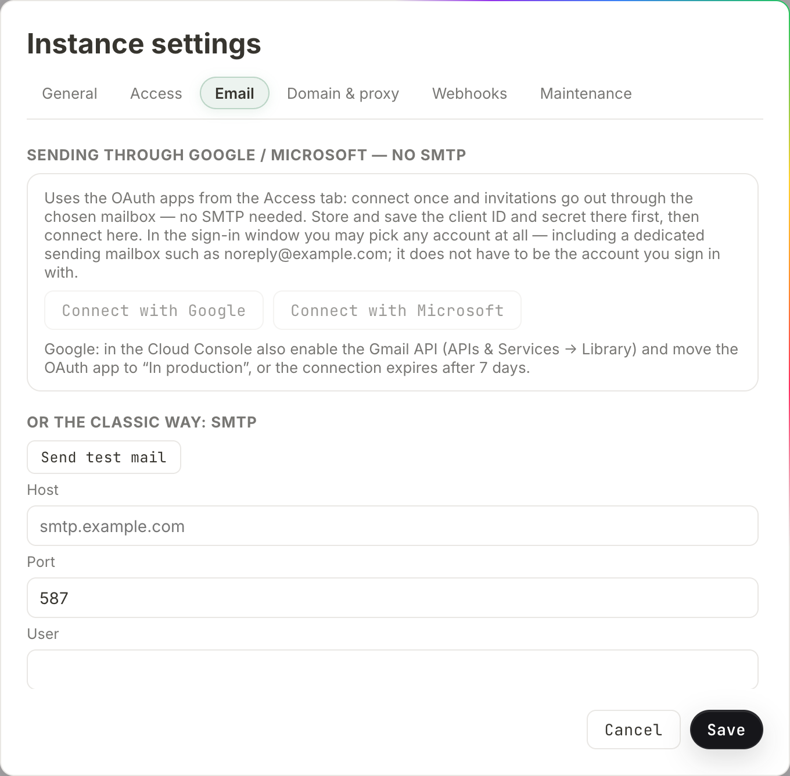

# Sending email

Salt.md can send email, and it sends very little of it. There are exactly three
messages, and every one of them is a notification about access — never about
your content. This page is for whoever runs the instance: it covers what gets
sent, the two ways to configure sending, every field in the dialog, the test
mail, and each error message you can meet.

Configuration is instance-wide and only an **instance admin** sees it. An
instance with no mail configured at all works completely — it just makes you
copy links by hand.

## What Salt.md sends

| Message | Subject | Goes to | Sent when |
| --- | --- | --- | --- |
| Invitation | `You have been invited to Salt.md` | the address typed into the invite field | somebody is invited to a workspace |
| Emergency access notice | `Emergency access to <workspace name>` | every admin of that workspace | the instance owner takes time-limited read access |
| Test message | `Salt.md test message` | the admin who pressed the button | you press **Send test mail** |

That is the whole list. There are no comment notifications, no mention alerts,
no page-change digests, no form-submission emails, and no marketing of any kind.
The body of a page, the contents of a collection and the files you upload never
travel by mail.

There is also **no forgotten-password email**. Nothing in Salt.md sends a reset
link, so no mailbox is a route into an account. A password is changed in the
account dialog by its owner, and only the instance owner can change somebody
else's — an admin who cannot reach a colleague's account sends them a fresh
invitation instead. See [Accounts](account.md) and
[Permissions](permissions.md).

### Email is a convenience, not a dependency

The invitation link is always shown on screen and copied to your clipboard,
whether or not mail went out. After pressing **Invite** you see

> Invitation link (valid 14 days, copied):

with the link in a field beside it, and a message that reads either
*Invitation sent by email* or *Invitation link copied*.

**That second message is also what you get when sending failed.** The invite
form does not report a mail error — it falls back to the link silently. So if
you configured mail and the toast still says *Invitation link copied*, sending
did not work; use **Send test mail** (below) to find out why.

The emergency-access notice behaves the same way. It is sent in the background,
one message per workspace admin, and a failure is recorded in the server log
only. The access itself is on the record either way, in the workspace's
emergency-access list and in the [activity log](history-and-audit.md).

## Where the settings live

1. Open the user menu and choose **Instance settings**. The entry only appears
   for instance admins.
2. Switch to the **Email** tab.
3. Fill in one of the two sections below.
4. Press **Save**. The dialog closes.

Two things on this tab act immediately and ignore **Save**: connecting or
disconnecting a mailbox, and **Send test mail**.

**The test mail tests what is stored, not what is on screen.** Typing SMTP
details and pressing **Send test mail** before **Save** tests the *previous*
settings. Save first, reopen, then test.

## Two ways to send

Salt.md sends either through a Google or Microsoft mailbox you connect once, or
through a plain SMTP server. If a mailbox is connected it is always used and
SMTP is ignored, even when both are filled in. To fall back to SMTP, press
**Disconnect**. Both sections sit under each other on the same tab:

### A connected Google or Microsoft mailbox

The section is headed *Sending through Google / Microsoft — no SMTP*. Salt.md
sends through the provider's own API — no server address, no port, no app
password, and it keeps working where a provider has switched basic
authentication off for SMTP.

**It needs an OAuth client first.** Mail sending reuses the same client ID and
secret as [signing in with Google or Microsoft](sso.md), stored on the
**Access** tab. Until a client ID *and* a secret are stored, the **Connect with
Google** and **Connect with Microsoft** buttons are greyed out and pressing one
says *Set up Google OAuth on the Access tab first*.

**Connecting is its own consent, separate from sign-in.** Setting up Google for
login grants Salt.md nothing about mail: this flow asks for a send permission of
its own and stores its own token. Doing one does not do the other.

To connect:

1. Store the client ID and secret on the **Access** tab and press **Save**.
2. In the provider's console, add the mail callback address as a redirect URI:
   your public base URL plus `/api/admin/mail-oauth/{provider}/callback`, with
   `{provider}` being `google` or `microsoft`. This is **not** the same address
   as the sign-in callback the Access tab shows you — the mail flow has its own,
   and the provider rejects a redirect it has never been told about.
3. Back on the **Email** tab, press **Connect with Google** or **Connect with
   Microsoft**.
4. Pick the mailbox in the provider's own window and approve.
5. You land back in Salt.md with *Mail sending connected ✓*.

What each provider is asked for:

| Provider | Permission requested | How the message is sent |
| --- | --- | --- |
| Google | `openid email` plus permission to send Gmail — not read, not delete | the Gmail send API |
| Microsoft | `openid email`, `Mail.Send` and `offline_access` | Microsoft Graph, with a copy filed in the mailbox's Sent Items |

`offline_access` is what lets the connection keep working tomorrow without
somebody clicking consent again. Google is asked the equivalent, which is why
its window shows the consent screen even for an account that has approved
Salt.md before.

**Any mailbox will do.** The sign-in window is forced to show the account
picker, and the account you choose has nothing to do with the account you sign
in to Salt.md with — a dedicated `noreply@example.com` sending mailbox is a
perfectly good choice.

**If you opened Salt.md on a different address than its public base URL**,
pressing Connect first bounces you to the public one, because the flow's cookie
belongs to that host. Sign in there and press Connect again.

For Google there is one more step in the Cloud Console, and the dialog says so:

> Google: in the Cloud Console also enable the Gmail API (APIs & Services →
> Library) and move the OAuth app to "In production", or the connection expires
> after 7 days.

An app left in testing stops sending a week later, with no change on your side.

Once connected the tab shows a green line — *Connected: sends as* the address,
followed by *(Gmail)* or *(Microsoft)* — plus **Send test mail** and
**Disconnect**.

#### Sending under a different address

**Override the sender address (optional, alias)** replaces the From address on
outgoing mail. The dialog's own condition:

> The address has to be an alias of the connected mailbox (Gmail: verify it
> under "Send mail as" in the Gmail settings; Microsoft: alias or send-as
> permission). Want a different mailbox entirely? "Disconnect", then pick the
> account you want in the sign-in dialog when reconnecting.

Two things to know. It takes effect on **Save**, unlike connecting. And it
applies only to the connected-mailbox path — with SMTP, the sender is the
**Sender (From)** field instead, and this one does nothing.

#### Disconnecting

**Disconnect** makes Salt.md forget the provider, the stored token and the
address, and reports *Mail connection disconnected*. It clears the Salt.md side
only: the permission you granted stays listed in your Google or Microsoft
account until you remove it there.

### The classic way: SMTP

The second section is headed *Or the classic way: SMTP*. Use it when there is no
Google or Microsoft tenant, when the machine may only reach your own relay, or
when the mail has to come from a service address on your own infrastructure.

| Field | Example shown | What it does |
| --- | --- | --- |
| Host | `smtp.example.com` | the mail server. **Empty means mail is off.** |
| Port | `587 / 465` | defaults to 587 when left blank |
| User | — | login name. Leave blank for a relay that wants no authentication |
| Password | `•••••• (unchanged)` or `not set` | never sent back to the browser |
| Sender (From) | `salt@example.com` | the From address |

The behaviour behind those fields:

- **Port 465 means implicit TLS** — the connection is encrypted from the first
  byte. Every other port, 587 included, is opened plainly and upgraded with
  STARTTLS.
- **A blank User means no authentication is attempted at all.** That is right
  for an internal relay and wrong for every hosted provider.
- **A blank Sender falls back** to the User, and if that is blank too, to
  `salt@` plus the host name. Most providers reject a From address they do not
  recognise, so fill it in.
- **The password is write-only.** The dialog shows `•••••• (unchanged)` when one
  is stored and `not set` when none is; leaving the field empty on **Save**
  keeps whatever is stored. To stop using SMTP, clear the **Host** — that is
  what switches sending off.

## Test it before you need it

There is a **Send test mail** button in both sections; they do the same thing.
It sends to **your own address** — the one on the account you are signed in
with — through whatever is currently stored, and reports *Test mail sent to*
that address on success. The message is short by design: subject *Salt.md test
message*, one line of body.

A failure shows what failed, including the text the provider or the mail server
returned, in brackets after the sentence. That provider text is passed through
untranslated on purpose: nobody can translate a message somebody else wrote.

Do this before you invite anybody.

## Why invitations go out in English

Every account can pick its own [language](language-and-time.md), and the
interface follows it. Mail cannot. An invitation reaches somebody who has no
account on this instance yet, so there is no language preference to read — the
server would have to guess. It sends English instead, the same language the
product's source is written in. The emergency-access notice goes out in English
for the same reason.

## When something goes wrong

Errors from mail arrive as a message in your own language, with any text the
provider wrote appended verbatim in brackets. These are the ones you can see:

| Message | What it means |
| --- | --- |
| *No mail delivery is configured — set up SMTP, or connect Google or Microsoft.* | No mailbox connected and no SMTP host. Nothing is broken; nothing is set up. |
| *No mail provider is connected.* | A mailbox is connected but the OAuth client it belongs to is gone — see below. |
| *Enter the client ID and secret in the Access tab first.* | Connecting was attempted with no OAuth client stored. |
| *The connection to the mailbox has expired — connect it again.* | The stored token no longer works: consent was withdrawn, a password changed, or a Google app left in testing hit its seven days. Press **Connect** again. |
| *The provider refused to send the message.* | The mailbox is reachable but rejected this message — usually a sender address it will not send as, or a permission missing in the tenant. The provider's own words follow in brackets. |
| *Cancelled.* | You closed or declined the provider's consent window. |
| *Expired — please connect again.* | More than ten minutes passed between pressing Connect and finishing. |
| *Could not be verified — please connect again.* | The round trip could not be matched to the one you started. Start again from the Email tab, not from a bookmarked link. |
| *No authorization code.* / *Token exchange failed.* / *The provider refused the connection.* | The provider ended the exchange early. The reason it gave follows in brackets. |
| *No refresh token received — remove the access in your account settings and connect again.* | The provider handed back a one-off permission instead of a lasting one, which happens when the account has already approved this app. Remove Salt.md from that account's connected apps and connect once more. |

**SMTP failures read differently.** They are passed through as the mail server's
own error — a refused connection, a rejected login, a TLS complaint — in
English, because that text comes from the server you are talking to and not from
Salt.md.

Three cases worth naming separately:

**Nothing arrives and nothing failed.** Check the spam folder first, then
whether the sender address is one the mailbox is actually allowed to send as.
Providers accept the submission and drop the message when it is not.

**It sent yesterday and not today.** For a connected mailbox that is the stored
token: consent withdrawn, a password change, a policy expiring it, or the Google
seven-day case. Reconnect. For SMTP it is usually a rotated app password.

**The tab says *Connected: sends as …* and every send says *No mail provider is
connected*.** The connection and the OAuth client are stored separately, and the
green line only checks the connection. Clearing or replacing the client ID on
the **Access** tab therefore leaves a mailbox that looks connected and cannot
send. Put the client ID back, or press **Disconnect** and connect again.

## Links in the mail point at the wrong address

Invitation links are built from the instance's public address, not from whatever
host the browser happened to use. Salt.md picks the first of these that exists:
the **Public base URL** from *Instance settings → General*, then a configured
HTTPS domain, then a running tunnel address, and only then the address of the
request itself.

So an invitation created while you were on `192.0.2.10` carries a link the
recipient can open — as long as one of the first three is set. If invited people
report a link that does not resolve, set **Public base URL (for links, mail,
calendars)** on the **General** tab to the address they can reach, for example
`https://notes.example.com`. The same value matters for
[sign-in](sso.md) and for [reaching the instance from outside](domain.md).

Invitation links are valid for **14 days**. After that the recipient sees that
the invite has expired and needs a new one.

## Turning it off

Clear the SMTP **Host** and press **Save**; press **Disconnect** if a mailbox is
connected. Sending is then off, and Salt.md behaves exactly as it does on an
instance that never configured mail: invitations show their link on screen for
you to send however you like, and emergency-access notices exist only in the
log.

See also: [Workspaces](workspaces.md) for who may invite,
[Administration](administration.md) for the rest of the instance settings, and
[Single sign-on](sso.md) for the OAuth clients this page borrows.
