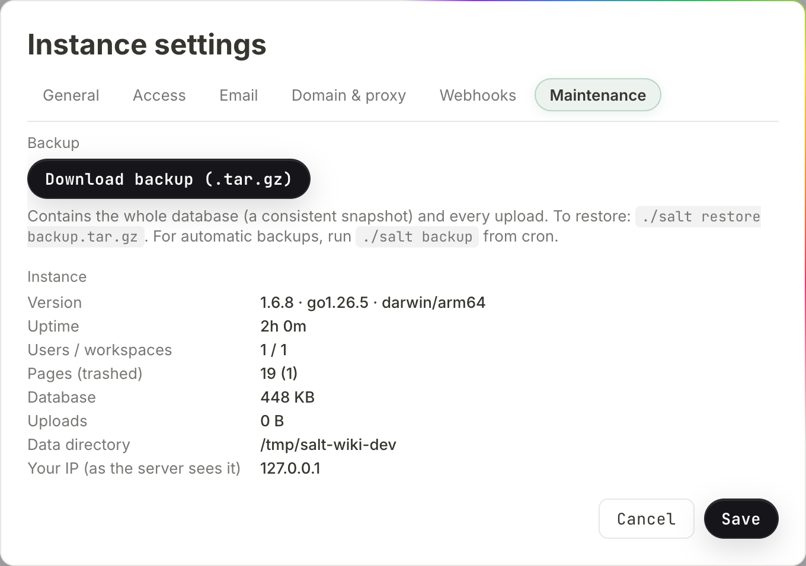

# Self-hosting

This page is for whoever runs the server. It covers every way to install
Salt.md, every environment variable and what it defaults to, how the process
decides how much work it can afford, what the startup log is telling you, and
how to back up, restore and update without losing anything.

Salt.md is **one process**. The frontend is compiled into the binary, SQLite is
a pure-Go library (the builds have CGO switched off), and nothing else has to be
running: no database server, no Node, no Redis, no reverse proxy unless you want
one. Everything the instance owns lives in one directory.

## Installing

### The installer script

```sh
curl -fsSL https://raw.githubusercontent.com/salt-md/salt.md/main/install.sh | sh
salt
```

The script reads `uname` and picks the matching prebuilt binary — Linux and
macOS, x86-64 and arm64. It installs to `/usr/local/bin/salt` when that
directory is writable, uses `sudo` when it is not, and falls back to
`~/.local/bin` when there is no `sudo` either. It then prints how to run the
binary, and warns you when the directory it chose is not on your `PATH`.

Two variables change what it does:

| Variable | Effect |
| --- | --- |
| `BIN_DIR=/path` | install there instead of the automatic choice |
| `SALT_VERSION=v1.6.13` | download that release tag instead of `latest` |

The tag needs its leading `v` — it goes into the download URL unchanged.

The installer does **not** verify a checksum. If that matters to you, take the
manual route under [Updating](#updating), which does.

Windows is not covered by the script (it stops with "Unsupported OS"), but a
`salt-windows-amd64.exe` is published with every release — download it by hand.

### Docker

```sh
docker run -d --name salt --restart unless-stopped \
  -p 8420:8420 -v salt-data:/data --memory=4g \
  ghcr.io/salt-md/salt.md:latest
```

The image is published for `linux/amd64` and `linux/arm64`. It runs as an
unprivileged user, sets `SALT_ADDR=:8420` and `SALT_DATA=/data`, declares
`/data` as a volume and exposes 8420.

**Set `--memory`.** A container with no limit cannot tell how much of the host
it is meant to get, so Salt.md assumes a small machine — see
[Memory](#memory-and-what-it-changes) for what that costs you.

There is a `docker-compose.yml` in the repository with the same shape
(`mem_limit: 4g`, a named volume, commented-out lines for `SALT_MEMORY_MB` and
for mounting your own certificates).

### From source

```sh
make build     # frontend, then backend
./salt
```

Needs Go 1.25 and Node 20. `make frontend` runs `npm run build`, which runs the
whole check gate first — type checking, the translation catalogue, the date
formatting suite and this wiki against the code. That gate is deliberate; a
build that skips it can ship a broken string catalogue.

### As a systemd service

The repository ships a unit at `deploy/salt.service`:

```ini
[Service]
User=salt
Group=salt
WorkingDirectory=/opt/salt
ExecStart=/opt/salt/salt
Environment=SALT_ADDR=:80
Environment=SALT_DATA=/opt/salt/data
AmbientCapabilities=CAP_NET_BIND_SERVICE
Restart=on-failure
RestartSec=2
KillSignal=SIGTERM
TimeoutStopSec=20
```

`CAP_NET_BIND_SERVICE` is what lets an unprivileged user bind port 80.
`TimeoutStopSec=20` matters: on `SIGTERM` the binary stops the Cloudflare
connector, drains requests still in flight (up to 12 seconds), waits briefly for
the connector to confirm, and closes the database cleanly. Cut the timeout
shorter and you can interrupt that.

## First run

Open the address the server printed and you get the setup screen:
**"Create the first (admin) account for this workspace."** — *Your name*,
*Email*, *Password (min. 8 characters)*, then **Create workspace**.

Whoever completes that becomes the **instance owner**, gets a workspace, and is
its admin. The screen is available exactly once: with an account already in the
database, setup answers "setup already completed". A fresh data directory also
gets one seeded page, *Welcome to Salt.md* — deleted, it does not come back on
the next start.

From there, [Administration](administration.md) covers who may sign up,
[Mail](mail.md) covers invitations and password resets, and
[Reaching your instance](domain.md) covers domains and certificates.

## The command line

The binary takes a handful of subcommands before it decides to be a server:

| Command | What it does |
| --- | --- |
| `salt` | start the server |
| `salt backup [file]` | write a consistent archive (default `salt-backup.tar.gz`) |
| `salt restore <file>` | unpack an archive into the data directory |
| `salt version` | print the version and exit |
| `salt fix-notion-rows` | one-time cleanup of Notion-imported row bodies |

Two things about this list are easy to get wrong.

**Only those four words are subcommands.** Anything else — including
`salt --version` — is not recognised, and the process goes on to **start a
server**. On a machine where the service is already running that means a second
instance on the same port, and a command that never returns. Read the version
from the log, from `salt version`, or from `/api/health`.

**The subcommands read `SALT_DATA` too.** `salt backup` run from cron without
the same `SALT_DATA` as the service looks in `./data`, finds nothing, and stops
with "no database at …".

`fix-notion-rows` needs the server stopped — it takes the database's only
connection.

## Configuration

Every variable carries the `SALT_` prefix. The prefix is not optional: a bare
`DATA=/srv/salt` is silently ignored and the server writes into `./data`.

| Variable | Default | What it does |
| --- | --- | --- |
| `SALT_ADDR` | `:8420` | listen address |
| `SALT_DATA` | `./data` | data directory — database and uploads |
| `SALT_MEMORY_MB` | detected | how much memory to assume (below) |
| `SALT_TRASH_DAYS` | `30` | days before trashed pages are purged; `0` disables |
| `SALT_TLS_CERT` | empty | certificate file — serves HTTPS directly |
| `SALT_TLS_KEY` | empty | matching key file |
| `SALT_RESTORE_FORCE` | empty | any value lets `salt restore` overwrite an existing database |
| `SALT_IMPORT_ALLOW_PRIVATE` | empty | must be exactly `1`; lets the URL importer reach private addresses (development only) |

Notes worth having before you hit them:

- **TLS needs both halves.** With only `SALT_TLS_CERT` set and no key, neither
  TLS branch applies and the server listens as plain HTTP without complaining.
- **`SALT_TLS_CERT` also switches off the built-in Let's Encrypt path**, even
  when the certificate setting in the admin dialog is active. One or the other.
- **`SALT_TRASH_DAYS` loses to the admin setting.** The retention is read from
  the setting first, the variable second, and 30 last. The Instance settings
  dialog shows the effective number in *Empty the trash automatically after
  (days, 0 = never)* and writes it as a setting when you press **Save** — after
  which the variable no longer has any effect.
- **The upload cap is not an environment variable.** It is *Max. file size per
  upload (MB)* in Instance settings, between 1 and 2048, default 50.

## Where things live

Everything is under `SALT_DATA`. The admin dialog shows the resolved path as
*Data directory* under Instance settings → **Maintenance**.

| Path | What it is |
| --- | --- |
| `salt.db` | the database — pages, workspaces, accounts, the search index |
| `salt.db-wal`, `salt.db-shm` | SQLite's write-ahead log and its shared index |
| `files/` | every upload, one file per byte-blob, served under `/files/` |
| `bin/` | `cloudflared`, downloaded on demand when you start a tunnel |
| `certs/` | Let's Encrypt cache, only when the built-in HTTPS is active |

The database runs in WAL mode on a **single connection**. That is why the
subcommands want the server stopped, and why a recent change may be sitting in
`salt.db-wal` rather than in `salt.db` — see [Backing up](#backing-up).

## Memory, and what it changes

Salt.md sizes its most expensive work — extracting text out of PDFs so it is
searchable — to the memory it believes it has. It looks in this order:

1. `SALT_MEMORY_MB`, if it is a positive number.
2. The container's cgroup limit (`memory.max` on cgroup v2,
   `memory.limit_in_bytes` on v1).
3. `/proc/meminfo`.

With one deliberate exception: **inside a container with no limit set, it
assumes 2 GB** rather than believing `/proc/meminfo`, which inside a container
reports the *host's* memory. A 512 MB container on a large host would otherwise
talk itself into work that gets it killed. If the host itself is smaller than
2 GB, the smaller figure wins.

What the number actually decides:

| Available memory | Largest PDF whose text is indexed | Extractions at once |
| --- | --- | --- |
| unknown (e.g. macOS, where `/proc/meminfo` does not exist) | 10 MB | 1 |
| under 4 GB | 1 % of it, at least 5 MB | 1 |
| 4 – 12 GB | 1 % of it | 2 |
| over 12 GB | 1 % of it, at most 50 MB | 3 |

It also tells Go's garbage collector where the ceiling is — 80 % of the figure —
so the heap does not grow past a container limit and get the process killed.

**Getting this wrong never breaks an upload.** A PDF over the limit is stored,
listed, previewed and downloadable exactly as usual; only its text stays out of
the search index. That is the whole cost, and it is why the limit scales itself
instead of asking you.

Set `SALT_MEMORY_MB` by hand in one case: **nested containers**, such as Docker
inside an LXC container. There the cgroup file says "no limit" and
`/proc/meminfo` reports the outermost host, so neither source knows the truth.
Elsewhere, `--memory` on the container is the better answer because it is also
enforced.

## Reading the startup log

A healthy start is three or four lines. Each one answers a question people
otherwise go looking through source code for.

**`memory: 16000 MB available, soft limit 12800 MB, PDF indexing up to 50 MB, 3 extraction(s) at a time`**
The conclusion of the section above. If a PDF is not searchable, this line says
why.

**`memory: no container limit is set, so this assumes a small instance. Run with --memory=<size> …`**
Printed only when the process is in a container, has no cgroup limit and no
`SALT_MEMORY_MB`. It is the 2 GB assumption announcing itself.

**`memory: SALT_MEMORY_MB="…" is not a positive number of megabytes — ignoring it`**
A typo in the variable. Detection continues as if it were unset.

**`search index: rebuilt (version 3, 736 pages)`**
The full-text index was rebuilt because its version changed — normally after an
upgrade that touched the tokenizer. **The absence of this line is meaningful**:
it means the running binary recognised the index it found, which is exactly what
you want to see after a restore. A companion line, `search index: N of M pages
could not be indexed`, appears only when some pages failed.

**`file index: built (version 2, 626 files on 248 pages, 0 unreferenced)`**
Same idea for the file list. "Unreferenced" counts files on disk that no page
mentions — workspace logos and profile pictures are always in that number, since
they hang off a workspace or an account rather than a page. See
[Files](files.md).

**`Salt.md 1.6.16 listening on :8420 (data: /opt/salt/data)`**
The server is up. Two variants: `(TLS, data: …)` when you supplied a certificate
pair, and `(auto-HTTPS for notes.example.com, data: …)` when the built-in
Let's Encrypt path is active — that one listens on `:443` and answers the ACME
challenge on `:80`.

**`tunnel: autostart (stored token)`, then `tunnel: connected (token)`**
A Cloudflare tunnel configured earlier coming back up by itself. On failure you
get `tunnel: cloudflared exited (…)` followed by `tunnel: retrying in 5s`.

During operation, one line is worth recognising:
`pdf extract <name>: skipped for indexing, N bytes is over the M byte limit (the
file itself is stored and listed as usual)`. It is not an error, and the
parenthesis is the point.

A clean shutdown prints `received terminated, shutting down…`, then
`stopped cleanly`.

## Health

```
GET /api/health
{"status":"ok","version":"1.6.16"}
```

No credential needed. It **pings the database**, so it distinguishes a
live-but-broken process from a healthy one: when the database does not answer,
the response is `503` with `{"status":"unavailable"}`. Point an uptime monitor,
a Docker health check or an orchestrator at it.

One inconsistency to know about when you compare strings: a release **binary**
is stamped with the tag as written (`v1.6.16`), while the **container image** is
stamped without the leading `v` (`1.6.16`). Same release, two spellings.

Instance settings → **Maintenance** shows the same facts in the browser:
*Version* (with the Go version and the OS/arch it was built for), *Uptime*,
*Users / workspaces*, *Pages (trashed)*, *Database* and *Uploads* as sizes on
disk, *Data directory*, and *Your IP (as the server sees it)* — the last one is
how you check whether a reverse proxy's headers are arriving, since it shows
`proxy headers active` when that setting is on.



In the background, every 30 minutes the server drops expired sessions, discards
idempotency keys older than a day, prunes its rate-limit buckets, sweeps stale
OAuth state, and empties trash past the retention.

## Backing up

Two things need saving, and they are both under `SALT_DATA`: the database and
the `files/` directory. Nothing else in that directory is irreplaceable.

**Use the built-in command.** It takes a transactionally consistent snapshot of
the database (`VACUUM INTO`, so anything still in the write-ahead log is
included) and adds every upload, into one gzip'd tar:

```sh
SALT_DATA=/opt/salt/data salt backup /var/backups/salt-$(date +%F).tar.gz
```

This is **safe against a running instance** — it opens its own read connection,
which WAL mode allows. That makes it a cron job rather than an outage. The admin
dialog says the same: *"For automatic backups, run `./salt backup` from cron."*

**Or download one from the browser.** Instance settings → Maintenance →
**Download backup (.tar.gz)**. The file is named
`salt-backup-<date>-<time>.tar.gz`. This is **owner-only**, not admin-only:
"Only the owner can download an instance backup — it contains every workspace."
An admin who manages accounts does not get everybody's content by pressing a
button.

**If you insist on copying by hand, stop the server first.** Copying `salt.db`
on its own while the server is writing gives you a stale database, because the
recent changes are still in `salt.db-wal`. Copy `salt.db`, `salt.db-wal` and
`salt.db-shm` together, or conclude nothing from what you got. This is the
single most common way a "backup" turns out to be worthless.

## Restoring

```sh
systemctl stop salt
SALT_DATA=/opt/salt/data salt restore /var/backups/salt-2026-08-07.tar.gz
systemctl start salt
```

The server must be stopped — the restore takes the database's only connection.

It **refuses to overwrite**: with a `salt.db` already in the directory you get
"…/salt.db already exists; set SALT_RESTORE_FORCE=1 to overwrite". That guard is
there because the mistake it prevents is unrecoverable. Any non-empty value of
the variable lifts it.

Restoring drops any stale `salt.db-wal` and `salt.db-shm` first, so the restored
database is never mixed with journal state from the instance it replaced, and it
rejects an archive containing a path that points outside the directory.

It does **not** empty the directory, though: files that the archive does not
contain stay where they are. For a clean restore, restore into an empty
directory. Uploads that no page references any more are harmless — they show up
in the count of unreferenced files and nowhere else.

## Updating

A release publishes two artefacts from the same tag: five binaries plus a
`SHA256SUMS.txt` on the GitHub Release (which is where the installer fetches
from), and a container image on GHCR tagged both with the version and as
`latest`.

**Installed with the script:** re-run it. Pin with
`SALT_VERSION=v1.6.13` if you do not want the newest.

**By hand, with the checksum verified:**

```sh
mkdir -p /tmp/salt-1.6.16 && cd /tmp/salt-1.6.16
wget -O salt-linux-amd64 \
  https://github.com/salt-md/salt.md/releases/download/v1.6.16/salt-linux-amd64
wget -O SHA256SUMS.txt \
  https://github.com/salt-md/salt.md/releases/download/v1.6.16/SHA256SUMS.txt
grep salt-linux-amd64 SHA256SUMS.txt | sha256sum -c -

systemctl stop salt
salt backup /var/backups/salt-before-1.6.16.tar.gz
cp -a /opt/salt/salt /opt/salt/salt.bak
install -m 755 salt-linux-amd64 /opt/salt/salt
systemctl start salt
```

Download into a **fresh, empty directory**. `wget` without `-O` does not
overwrite an existing file — it writes `salt-linux-amd64.1` beside it — and a
checksum check then happily verifies the old file against the old sums file and
reports success. Keeping the previous binary next to the new one is the whole
rollback plan, and it takes one line to use.

**With Docker:** `docker pull` first (it changes nothing until you replace the
container), then stop, back up the volume, and recreate. The stop is the only
downtime and also the only moment a clean copy of the volume is possible, so do
both in one go.

**Migrations run on start and only ever add.** Columns and tables are created if
missing; nothing is dropped or rewritten in place. Skipping versions is fine —
an instance can migrate across several releases in one start, and the search
index rebuilds itself when its version moved.

**Verify by behaviour, not by the version string.** A mislabelled build reads
exactly like a correct one. Compare `sha256sum /opt/salt/salt` against the
published `SHA256SUMS.txt`, or pick something the new version has and the old
does not and check for that. The version string is the last thing to trust.

## Reaching it from outside

Out of the box the server answers on `:8420` on your own network. There are
three ways to give it a name and a certificate, all configured in Instance
settings → **Domain & proxy**: a Cloudflare tunnel (nothing has to accept
incoming connections), the built-in Let's Encrypt certificate (needs ports 80
and 443 and a DNS record pointing here, and a restart after saving), or your own
reverse proxy. [Reaching your instance from outside](domain.md) walks through
each one, including why the public base URL has to be set whichever you choose.

`SALT_TLS_CERT` and `SALT_TLS_KEY` are the fourth way: your own certificate
pair, served directly, no proxy and no Let's Encrypt.

## When something is wrong

[Troubleshooting](troubleshooting.md) collects symptoms. The three that belong
to the server rather than to the product:

- **Port open, requests hanging.** The database runs on one connection; one
  request that cannot finish blocks the rest. Check the log for an extraction or
  an import.
- **A PDF is not searchable.** Read the `memory:` line at startup and the
  `pdf extract … skipped for indexing` line. The file itself is fine.
- **A restore looks like it did nothing.** Check for a `search index: rebuilt`
  line. Its *absence* is the proof that the binary recognised the database it
  opened.
